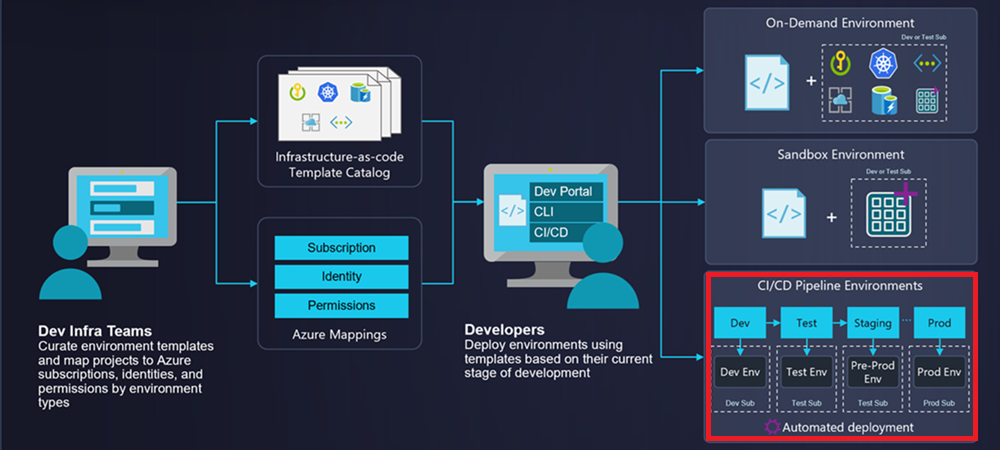
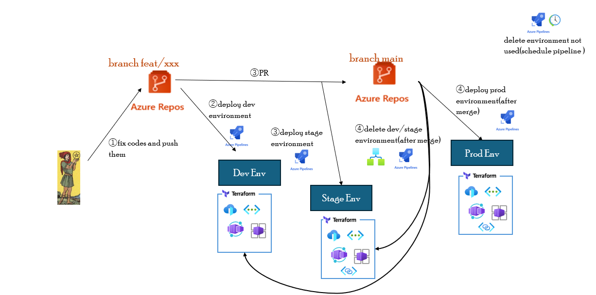

# Azure Devloyment Enviroment(ADE) の環境ライフサイクルを Azure Devops Pipeline で実装してみよう

昨今では、事前に定義したインフラ構成を開発者のセルフサービスで提供するプラットフォームエンジニアリングが話題ですが、Azure では Azure Devloyment Enviroment(ADE)がその代表サービスになります。 
その際、開発の DevOps に応じた ADE の環境ライフサイクルの実装は、必要不可欠です。 
この章では、ハンズオンを通じて、Azure Devops Pipeline を使用した ADE 環境ライフサイクルの実装例を示します。

## 前提条件

- 下記の基本知識があること。
  - ADE
  - Git
  - Azure Devops Repos Git
  - Azure Devops Pipeline

## ADE 環境ライフサイクルの全体図

下記に、ADE 環境ライフサイクルの全体図を示す。

## ADE 環境ライフサイクルの実装

### 環境構築

[環境構築](./terraform/環境構築.md)

### ハンズオン

[ハンズオン](./handson/ハンズオン.md)

### 環境削除

[環境削除](./terraform/環境削除.md)

## 実装を通じた気づきと役立つ参考情報

[実装を通じた気づきと役立つ参考情報](./実装を通じた気づきと役立つ参考情報.md)
