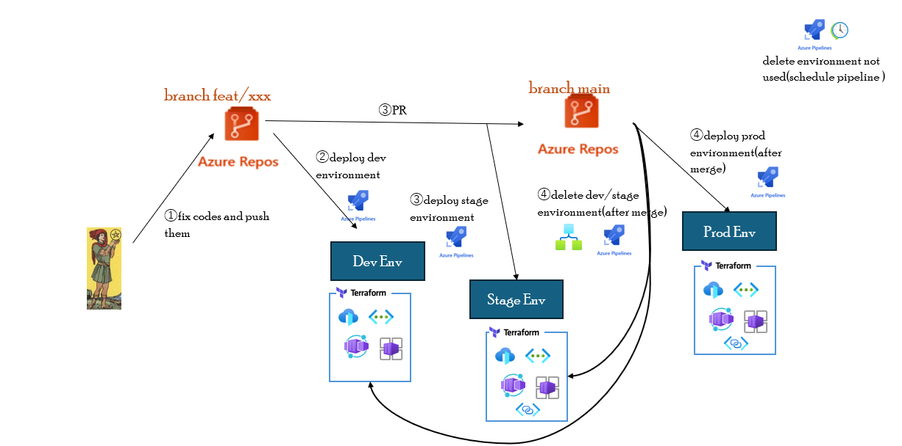

# ADE 環境ライフサイクルのハンズオン

ハンズオンの全体図を下記に示す。



## 前提条件

- 下記の基本知識があること。
  - Git
  - ADE
  - Azure Devops Repos Git
  - Azure Devops Pipeline

## ハンズオン上の注意点

- [ブランチへのマージ](./ハンズオン.md#main-ブランチへマージ)の手順で、stage 環境の削除に失敗することがあります。(理由として、環境作成時に frontdoor からのプライベートリンクサービスのコネクション要求が複数作成されることがあり、環境削除時に一つしか削除されないからです)<br>
  その場合、プライベートリンクサービス上のすべてのコネクション要求を削除してから、パイプラインを再実行してください。

## ハンズオン

### feat/test ブランチの作成と Dockerfile の編集

- Azure Repos Git の UI で、[環境構築手順でインポートした ADE-Pipeline-ADO リポジトリ](../terraform/環境構築.md#git-リポジトリのインポートと-dev-center-のカタログ追加)の main ブランチから feat/test ブランチを作成する
  
- ローカルに ADE-Pipeline-ADO リポジトリをクローンする。(すでにクローンしている場合は、git fetch を実施)
- feat/test ブランチに checkout し、src/Dockerfile に行を追加する

```bash
FROM mcr.microsoft.com/dotnet/sdk:6.0 AS build-env
WORKDIR /app
# test ←この行を追加
# Copy csproj and restore as distinct layers
COPY *.csproj ./
RUN dotnet restore

# Copy everything else and build
COPY . .
RUN dotnet publish -c Release -o out

# Build runtime image
FROM mcr.microsoft.com/dotnet/aspnet:6.0
WORKDIR /app
COPY --from=build-env /app/out .
EXPOSE 8080
ENV ASPNETCORE_URLS=http://+:8080
ENTRYPOINT ["dotnet", "albumapi_csharp.dll"]
```

- 編集を git commit し、origin の feat/test に push する<br>
  → push 後、パイプラインがトリガーされ Dev 環境がデプロイされる。(パイプライン終了まで 20 分ほどかかる)

### PR の作成

- main ブランチへのプルリクを作成する<br>
  → プルリク作成後、パイプラインがトリガーされ stage 環境がデプロイされる。(パイプライン終了まで 20 分ほどかかる)

### main ブランチへマージ

> Dev 環境と stage 環境のパイプライン終了後に、マージすること

- PR を承認し、main ブランチへマージする。<br>
  → マージ後、パイプラインがトリガーされ prod 環境がデプロイされる。また logic app への webhook を介して、Dev 環境と Stage 環境を削除するパイプラインもトリガーされる。

ハンズオンは以上で終わりです。<br>
[環境削除について、こちら参照](../terraform/環境削除.md)
