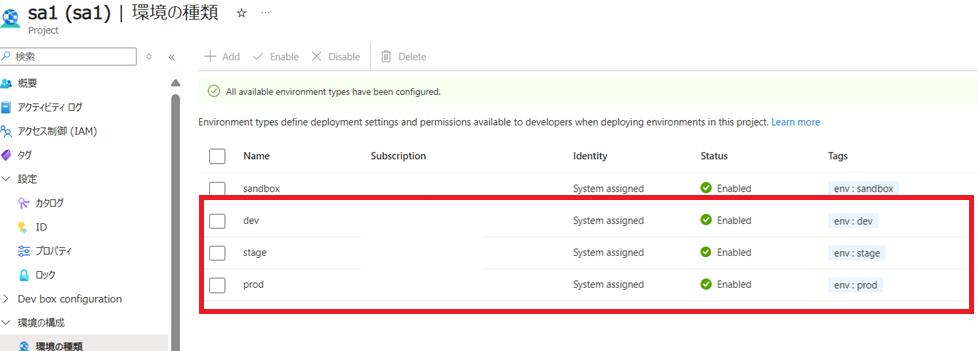
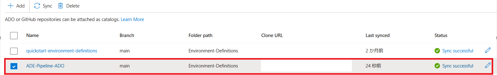
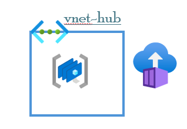

# 環境構築

## 前提条件

- Dev Center と Azure Devops Orgnization(ADO) のプロジェクトは事前に作成していること
- 以下の環境の種類を事前に作成していること

  > 各環境の種類の環境作成者ロールには共同作成者を設定すること。

  - dev
  - stage
  - prod

    

- [ADE で Terraform テンプレートをデプロイできるように構成していること](https://learn.microsoft.com/ja-jp/azure/deployment-environments/how-to-configure-extensibility-model-custom-image?tabs=custom-script%2Cterraform-script%2Cprivate-registry&pivots=terraform)
  - [環境の種類(dev、stage、prod)に Acrpull の rbac 設定を忘れずに](https://learn.microsoft.com/ja-jp/azure/deployment-environments/how-to-configure-extensibility-model-custom-image?tabs=custom-script%2Cterraform-script%2Cprivate-registry&pivots=terraform#assign-the-acrpull-role)
  - [各 environment.yaml の runner プロパティにカスタムイメージの参照先を記載すること](https://learn.microsoft.com/ja-jp/azure/deployment-environments/how-to-configure-extensibility-model-custom-image?tabs=custom-script%2Cterraform-script%2Cprivate-registry&pivots=terraform#connect-the-image-to-your-environment-definition)<br>
    →[Container-App-Frontdoor の environment.yaml](../Environment-Definitions/Container-App-Frontdoor/environment.yaml)と<br>[Container-App-Internal-Frontdoor の environment.yaml](../Environment-Definitions/Container-App-Internal-Frontdoor/environment.yaml)を編集
- ADO の PAT(フルアクセス権限)を事前に作成していること

## git リポジトリのインポートと Dev Center のカタログ追加

- ADO プロジェクトに ADE-Pipeline-ADO リポジトリをインポートする。
- Dev Center にインポートしたリポジトリのカタログを追加する。<br>
  下記画像のようにインポートすること。(ブランチは main、フォルダパスは Environment-Definitions を指定する)
  

## hub リソースの作成

ハブ VNET やパイプラインに必要な managed devops pool、ACR などのハブリソースを作成します。



> linux 上で実施すること

```bash
# ADE-Pipeline-ADO/terraform/hubに移動する
cd ADE-Pipeline-ADO/terraform/hub
# local_vars.tfの編集
## 編集例
locals {
  subscription_id = "<サブスクリプションID>"      #サブスクリプションIDを記入
  ado_orz         = "<ADOのorgnization名>" #ADOのorgnization名を記入
  devcenter = {
    devcenter_name     = "<Dev Center名>"           # Dev Center名を記入
    devcenter_endpoint = "<Dev Center Endpoint>"   # Dev Center Endpointを記入　例）xxxxxxx-testdevcenter.japaneast.devcenter.azure.com
    devcenter_rg       = "<Dev Center のリソースグループ名>" # Dev Center のリソースグループ名を記入
    devcenter_catalog  = "<Dev Center のカタログ名>"     # Dev Center上でインポートしたカタログ名を記入
  }
  vnet_cidr = "10.1.0.0/16"
  mdp_subnets = [
    # 10.1.0.0/28 10.1.0.16/28 10.1.0.32/28 10.1.0.48/28 10.1.0.64/28
    {
      subnet_address = "10.1.0.0/28"
      ado_pj_name    = "<ADOのプロジェクト名>"         #ADOのプロジェクト名を記入
      ado_repo_name  = "<ADOプロジェクトのgitリポジトリ名>" #インポートしたADOプロジェクトのgitリポジトリ名を記入
      devc_pj_name   = "<Dev Center のプロジェクト名>" #Dev Center のプロジェクト名を記入
    },
  ]
  managed_subnets = [
    {
      name           = "AzureBastionSubnet"
      subnet_address = "10.1.2.0/26"
    },
    {
      name           = "GatewaySubnet"
      subnet_address = "10.1.1.160/27"
    },
    {
      name           = "AzureFirewallSubnet"
      subnet_address = "10.1.1.64/26"
    },
  ]
}
## terraform initを実施
terraform init
## terraform applyを実施
terraform apply
```

## sa リソースの作成

ビルド定義やサービスコネクション、logic app へのサービスフックなどのパイプライン実行に必要な設定をします。

> linux 上で実施すること

```bash
# ADE-Pipeline-ADO/terraform/hubに移動する
cd ADE-Pipeline-ADO/terraform/sa
# local_vars.tfをコピー
cp -p ../hub/local_vars.tf .
## 環境変数の定義
export AZDO_ORG_SERVICE_URL="<ADOのorgnizationのURL>"
export TF_VAR_ado_pat="<ADOのPAT>"
export AZDO_PERSONAL_ACCESS_TOKEN="<ADOのPAT>"
## terraform initを実施
terraform init
## terraform applyを実施
### 失敗した場合、もう一度実行してください
terraform apply
```

環境構築は以上で終わりです。<br>
[次はハンズオンになります](../handson/ハンズオン.md)
