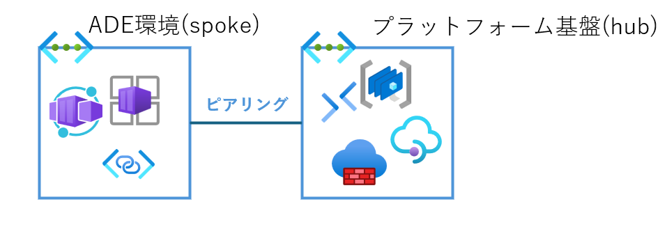
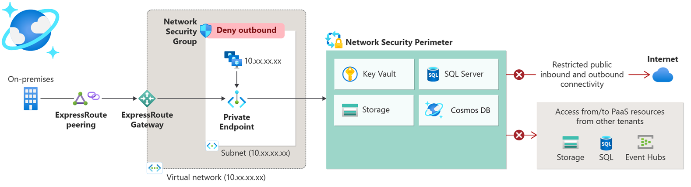

# 実装を通じた気づきと役立つ参考情報

## 環境ライフサイクルの実装を通じた気づき

### Container apps environment(CAE)を環境の種類ごとに共有化

今回のハンズオンでは パイプライン実行の度に CAE も作成されるが、CAE を別の環境定義(別テンプレート)とし、環境の種類(dev stage prod)ごとに共有化してもよい。

### 環境のパラメータ更新は避けたほうがよい

環境のパラメータ更新(az devcenter dev environment update)は、他の設定を初期化する(アプリケーションに応じた固有設定が削除される)可能性があるため、避けたほうがよい。
パラメータ更新が必要な場合、環境を再作成するか個別で更新する。

### アプリケーションに合わせて選定が必要なサービスは、個別の環境定義で用意

今回のハンズオンにはないが、実際はアプリケーションに合わせて DB や AI サービス、Key Vault、ストレージアカウントなどのサービスが必要になる。
これらの開発するアプリケーションの仕様ごとに必要なサービスは個別の環境定義として用意し、開発者が自由にカスタマイズできるようにするとよい。
また、環境定義を分けることでリソース個別で新しいバージョンの環境定義に移行できるなど運用面でもメリットがある。

### 環境の継続運用を考慮した環境定義の設計

特に prod 環境は継続運用されるため、それらを考慮した環境定義を設計する必要がある。 
例) ログの hub 集約、Azure WAF の導入など

## 役に立つ参考情報

### 日本語版 Azure 共通基盤（ランディングゾーン） 設計・構築ガイド

[日本語版の Azure 共通基盤（ランディングゾーン）の設計構築ガイド](https://github.com/nakamacchi/AzureCAF.LandingZones.Demo/tree/master)

### ADE 環境の一元管理

ADE 環境の一元管理に役立つ Azure 機能をいくつか紹介する

#### Virtual Network Manager(AVNM)

VNET ピアリング、NSG、UDR を一元的に管理する機能。 
接続トポロジーとして、メッシュ型、ハブアンドポーク及び直接接続を使用したハブアンドスポークがある。

- 構成例 
  プラットフォーム基盤と ADE 環境のハブアンドポーク
  

#### Network Security Perimeter(ANSP)

PaaS(Key Vault やストレージアカウントなど)のパブリックアクセスのファイアウォールルールを、送信受信ともに一元的管理する機能。 

ANSP で設定すると、PaaS 個別のファイアウォールルールは無視されるため、意図しないパブリックアクセス許可を防止できる。
